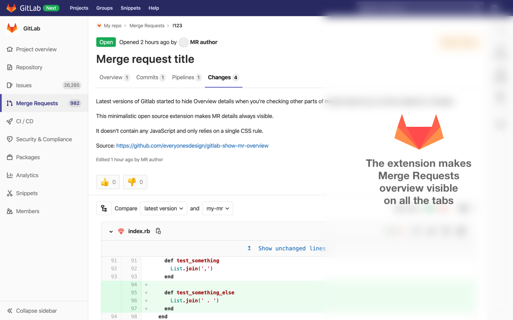

# Show MR overview in Gitlab

[ [Firefox Browser Add-ons](https://addons.mozilla.org/en-US/firefox/addon/show-mr-overview-in-gitlab/) ]

This is a minimalistic browser extension allowing to always show merge requests overview after it was hidden by interface change (see [this thread](https://gitlab.com/gitlab-org/gitlab/issues/36125) for more details).

The extension doesn't contain any JavaScript and relies on a single CSS rule.
